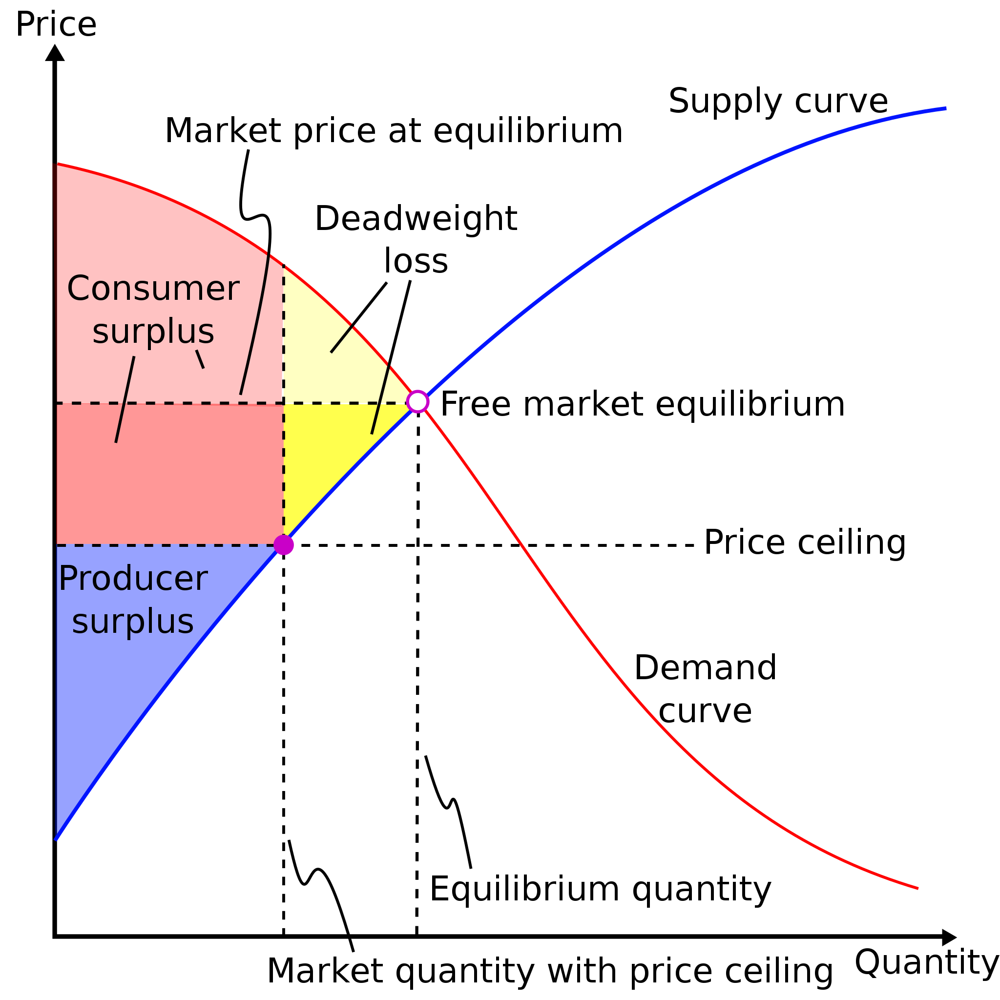

# ECON 2300 - Exam

## Pre-Midterm

#### Numeraire Good

Given an equation $ax_1+bx_2=c$ and numeraire good $x_n$, the budget line can be rewritten as $\frac{ax_1+bx_2}{x_n} = \frac{c}{x_n}$ 

#### Transitivity

- Jaden likes apples more than bananas, $b < a$

- Jaden likes oranges more than apples, $a < o$

- Jaden must like oranges more than bananas, $b < a <o \equiv a<o$.

#### Utility Functions

Given a utility function $u = ax+by$, Jaden is willing to trade $x$ units of $b$ for $y$ units of $a$. This is a *perfect substitute*.

#### Indifference Curves

* The slope at point $p$ is the amount that one is willing to pay for an addition unit of item $x$.

#### Margin Rate of Substitution

$$
MRS = -\frac{MU_{x_1}}{MU_{x_2}} ~~~~~~~~~~
MU_x = \frac{\partial u}{\partial x} = p_x
$$

$$
MRS(x_1^a x_2^b) = - \frac{ax_2}{bx_1} ~~~~~~~~~~
MU_{x_1} = \frac{ax_2^b}{x_1^{(1-a)}} ~~~~~~~~~~
MU_{x_2} = \frac{bx_1^a}{x_2^{(1-b)}}
$$

## Demand Functions

| Variable   | $X_i$    | $p_i$       | $M$    | $X_i^*$                      | $p'$      |
| ---------- |:--------:|:-----------:|:------:|:----------------------------:|:---------:|
| Definition | Good $i$ | Price $X_i$ | Income | Optimal consumption of $X_i$ | New Price |

#### Types of Graphs

- **Engel Curve**:
  
  - $Y$: Income
  
  - $X$: Quantity of Good$_i$
  
  - Line: $y=x(p_1+p_2)$
  
  - Slope: Positive → Normal good, Negative → Inferior good

- **Demand Curve**:
  
  - $Y$: Quantity of Good$_i$ 
  
  - $X$: $p_i$
  
  - Line = $\frac{M}{p_1+p_2}$

- **Inverse Demand Curve**

#### Goods

- **Normal Good**: Consumers purchase more as income increases 

#### Perfect, One-to-One Complements

$$
\begin{align*}
&\text{Utility Function}\hspace{13em}& U(X_1,X_2) = \min(X_1,X_2) \\
&\text{Buget Constraint} & p_1X_1+p_2X_2=M \\
&\text{Optimal Consumption} & X_i^*=\frac{M}{p_1+p_2}
\end{align*}
$$

```vega-lite
{
    "$schema": "https://vega.github.io/schema/vega-lite/v5.json",
    "data": {
        "values": [
            { "type": "Budget", "Good 1": 0, "Good 2": 1, "desc": "" },
            { "type": "Budget", "Good 1": 1, "Good 2": 0, "desc": "" },
            {
                "type": "Indifference",
                "Good 1": 0.5,
                "Good 2": 1.5,
                "desc": ""
            },
            {
                "type": "Indifference",
                "Good 1": 0.5,
                "Good 2": 0.5,
                "desc": "Optimal Choice"
            },
            {
                "type": "Indifference",
                "Good 1": 1.5,
                "Good 2": 0.5,
                "desc": ""
            },
            { "dash": true, "Good 1": 0, "Good 2": 0, "desc": "" },
            { "dash": true, "Good 1": 1, "Good 2": 1, "desc": "" },
            { "px": 0.5, "py": 0.5 },
            {
                "type": "Indifference",
                "Good 1": 1.5,
                "Good 2": null,
                "desc": ""
            },
            {
                "type": "Indifference",
                "Good 1": 1.5,
                "Good 2": 0.75,
                "desc": ""
            },
            {
                "type": "Indifference",
                "Good 1": 0.75,
                "Good 2": 0.75,
                "desc": ""
            },
            {
                "type": "Indifference",
                "Good 1": 0.75,
                "Good 2": 1.5,
                "desc": ""
            }
        ]
    },
    "layer": [
        {
            "mark": {
                "type": "point",
                "shape": "stroke",
                "angle": 155,
                "size": 900,
                "color": "black",
                "xOffset": 14,
                "yOffset": -7
            },
            "encoding": {
                "x": { "field": "px", "type": "quantitative" },
                "y": { "field": "py", "type": "quantitative" }
            }
        },
        {
            "mark": "line",
            "encoding": {
                "x": {
                    "field": "Good 1",
                    "type": "quantitative",
                    "axis": {
                        "title": "Good 1",
                        "ticks": false,
                        "labels": false,
                        "grid": false,
                        "titlePadding": 10
                    }
                },
                "y": {
                    "field": "Good 2",
                    "type": "quantitative",
                    "axis": {
                        "ticks": false,
                        "labels": false,
                        "grid": false,
                        "titlePadding": 10,
                        "title": "Good 2"
                    }
                },
                "color": {
                    "field": "type",
                    "title": "Curve",
                    "type": "nominal",
                    "legend": {
                        "values": ["Budget", "Indifference"]
                    }
                },
                "strokeDash": {
                    "field": "dash",
                    "legend": { "disable": true }
                },
                "order": { "field": "sort" }
            }
        },
        {
            "mark": {
                "type": "text",
                "align": "left",
                "xOffset": 30,
                "yOffset": -15
            },
            "encoding": {
                "x": {
                    "field": "Good 1",
                    "type": "quantitative"
                },
                "y": {
                    "field": "Good 2",
                    "type": "quantitative"
                },
                "text": { "field": "desc", "type": "nominal" }
            }
        }
    ]
}
```

#### Perfect, One-to-One Substitutes

$$
\begin{align*}
&\text{Utility Function}\hspace{10em}& U(X_1,X_2) = X_1+X_2 \\
&\text{Optimal Consumption} & X_1^*=
\begin{cases}
0 &\text{if }~~ p_1>p_2 \\
0 \leq X_1 \leq \frac{M}{p_1} &\text{if }~~ p_1=p_2 \\
\frac{M}{p_1} &\text{if }~~ p_1 \leq p_2
\end{cases}
\end{align*}
$$

```vega-lite
{
    "$schema": "https://vega.github.io/schema/vega-lite/v5.json",
    "data": {
        "values": [
            {
                "type": "Indifference",
                "Good 1": 2,
                "Good 2": 0
            },
            {
                "type": "Indifference",
                "Good 1": 0,
                "Good 2": 2
            },
            {
                "type": "Indifference",
                "Good 1": 0,
                "Good 2": null
            },
            {
                "type": "Indifference",
                "Good 1": 0,
                "Good 2": 3
            },
            {
                "type": "Indifference",
                "Good 1": 3,
                "Good 2": 0
            },
            {
                "type": "Indifference",
                "Good 1": 3,
                "Good 2": null
            },
            {
                "type": "Indifference",
                "Good 1": 4,
                "Good 2": 0
            },
            {
                "type": "Indifference",
                "Good 1": 0,
                "Good 2": 4
            },
            {
                "type": "Indifference",
                "Good 1": 0,
                "Good 2": null
            },
            {
                "type": "Indifference",
                "Good 1": 0,
                "Good 2": 5
            },
            {
                "type": "Indifference",
                "Good 1": 5,
                "Good 2": 0
            },
            {
                "type": "p₁ > p₂",
                "Good 1": 0,
                "Good 2": 3
            },
            {
                "type": "p₁ > p₂",
                "Good 1": 2,
                "Good 2": 0
            },
            {
                "type": "p₁ = p₂",
                "Good 1": 0,
                "Good 2": 3.5
            },
            {
                "type": "p₁ = p₂",
                "Good 1": 3.5,
                "Good 2": 0
            },
            {
                "type": "p₁ ≤ p₂",
                "Good 1": 0,
                "Good 2": 4
            },
            {
                "type": "p₁ ≤ p₂",
                "Good 1": 5,
                "Good 2": 0
            }
        ]
    },
    "layer": [
        {
            "mark": "line",
            "encoding": {
                "x": {
                    "field": "Good 1",
                    "type": "quantitative",
                    "axis": {
                        "title": "Good 1",
                        "ticks": false,
                        "labels": false,
                        "grid": false,
                        "titlePadding": 10
                    }
                },
                "y": {
                    "field": "Good 2",
                    "type": "quantitative",
                    "axis": {
                        "ticks": false,
                        "labels": false,
                        "grid": false,
                        "titlePadding": 10,
                        "title": "Good 2"
                    }
                },
                "color": {
                    "field": "type",
                    "title": "Curve",
                    "type": "nominal",
                    "legend": {
                        "values": ["Indifference", "p₁ > p₂", "p₁ = p₂", "p₁ ≤ p₂"]
                    }
                },
                "order": { "field": "sort" }
            }
        }
    ]
}
```

#### Cobb-Douglas Preferences

$$
\begin{align*}
&\text{Utility Function}\hspace{13em}& U(X_1,X_2) = X_1X_2 \\
&\text{Demand Function} & X_i(M,p_1,p_2)=\frac{M}{2p_i}
\end{align*}
$$

```vega-lite
{
    "$schema": "https://vega.github.io/schema/vega-lite/v5.json",
    "data": {
        "sequence": {
            "start": 0.01,
            "stop": 2,
            "step": 0.01,
            "as": "Good 1"
        }
    },
    "layer": [
        {
            "mark": "line",
            "transform": [
                {
                    "calculate": "clamp(1/(2 * datum['Good 1']), 0.25, 2)",
                    "as": "Good 2"
                }
            ],
            "encoding": {
                "x": {
                    "field": "Good 1",
                    "type": "quantitative",
                    "axis": {
                        "title": "Good 1",
                        "ticks": false,
                        "labels": false,
                        "grid": false,
                        "titlePadding": 10
                    }
                },
                "y": {
                    "field": "Good 2",
                    "type": "quantitative",
                    "axis": {
                        "ticks": false,
                        "labels": false,
                        "grid": false,
                        "titlePadding": 10,
                        "title": "Good 2"
                    }
                }
            }
        },
        {
            "mark": "line",
            "transform": [
                {
               "calculate": "clamp(SQRT2-datum['Good 1'],0,SQRT2)",
                    "as": "Good 2"
                }
            ],
            "encoding": {
                "x": {
                    "field": "Good 1",
                    "type": "quantitative",
                    "axis": {
                        "title": "Good 1",
                        "ticks": false,
                        "labels": false,
                        "grid": false,
                        "titlePadding": 10
                    }
                },
                "y": {
                    "field": "Good 2",
                    "type": "quantitative",
                    "axis": {
                        "ticks": false,
                        "labels": false,
                        "grid": false,
                        "titlePadding": 10,
                        "title": "Good 2"
                    }
                }
            }
        }
    ]
}
```

## The Slutsky Equation

- **Substitution Effect**: The change in consumption of $X_i$ due to a change in $p_i$
  
  - Constant buying power
  
  - $S.E.=X_i(M_\text{new}, P_\text{new})-X_i(M_\text{old},P_\text{old})$

- **Income Effect**: The change in consumption of $X_i$ due to a change in buying power as a result of a change in $p_i$
  
  - Constant prices
  
  - $I.E.=X_i(M_\text{old},P_\text{new})-X_i(M_\text{new},P_\text{new})$

- $\text{Total }\Delta X_i = S.E. + I.E. = X_i(M_\text{old},P_\text{new}) - X_i(M_\text{old},P_\text{old})$

|                |              | Normal Good |          |              | Inferior Good |         |
| -------------- |:------------:|:-----------:|:--------:|:------------:|:-------------:|:-------:|
| Effect         | Substitution | Income      | Overall  | Substitution | Income        | Overall |
| Price  $\uarr$ | $D\darr$     | $D\darr$    | $D\darr$ | $D\darr$     | $D\uarr$      | $?$     |
| Price  $\darr$ | $D\uarr$     | $D\uarr$    | $D\uarr$ | $D\uarr$     | $D\darr$      | $?$     |

## Surplus

<p float="left">


</p>

## Technology

| Variable   | $Q$    | $K$     | $L$    |
| ---------- |:------:|:-------:|:------:|
| Definition | Output | Capital | Labour |

**Isoquant**: Indifference curves for production. Constant output

$$
\def\arraystretch{1.25}\begin{align*}
&\text{Perfect Substitutes (Linear)}\hspace{6em}&Q &=f(K,L)=aK+bL \\
&\text{Perfect Complements (L-Shaped)} & Q&=f(K,L)=\min\{aK,bL\} \\
&\text{Cobb-Douglas (Arc)} & Q&=f(K,L)=AK^a L^b
\end{align*}\\
\def\arraystretch{2}\begin{align*}
&\text{Marginal Product} &\hspace{8.93em} MP = \frac{\partial Q}{\partial L} \text{ ~or~ } \frac{\partial Q}{\partial K} \\
&\text{Technical Rate of Substitution} & TRS=-\frac{MP_K}{MP_L} = - \frac{w_L}{w_K}
\end{align*}
$$

$$
\text{Returns to scale } (RTS) = \frac{f(xK,xL)}{f(K,L)}= \begin{cases} 
\text{Decreasing} &\text{if } < x \\ 
\text{Constant} &\text{if } =x \\
\text{Increasing} &\text{if } > x 
\end{cases}
$$

$$
\text{Cobb-Douglas RTS}\hspace{6em} y=AL^bK^c \implies RTS= x^{b+c}
$$


## Profit Maximization

| Variable   | $x_i$     | $\bar{x_i}$ | $w_i$         | $P$    | $p$             |
| ---------- |:---------:|:-----------:|:-------------:|:------:|:---------------:|
| Definition | Input $i$ | Fixed input | Cost of $x_i$ | Profit | Price of output |

$$
\def\arraystretch{1.25}\begin{align*}
&\text{Cost} & C=(w_1x_1+w_2x_2)\\
&\text{Profit}\hspace{20em}&P=p\times Q-C \\
&\text{Short Run PM}&p \times MP_i = w_i
\end{align*}
$$

#### Long Run PM

1. Solve $SRPM_i$ for $i$

2. Solve $SRPM_j$

3. Substitute $i$ in $SRPM_j$ and solve for $j$

## Cost Minimization

1. Solve the Production Function for $x_i$

2. Substitute $x_i$ into the cost equation, $w_ix_i+w_jx_j$

3. Solve $\frac{\partial Cost}{\partial x_j}=0$ for $x_j$
- Iso-cost Lines
  
  - $\text{Slope} = -\frac{w_1}{w_2}$

## Cost Curves

| Variable   | $PF_i$               | $K$        | $C$           | $y$    |
| ---------- |:--------------------:|:----------:|:-------------:|:------:|
| Definition | Solve $PF$ for $x_i$ | Fixed Cost | Variable Cost | Output |

$$
\def\arraystretch{1.25}\begin{align*}
&\text{Long-Run Cost}\hspace{8em}&C(w_1,w_2,y)=w_1 PF_1 + w_2 PF_2 \\
&\text{Short-Run Cost} & C_s(w_1,w_2,y)=C+w_2\bar x_2 = C+K \\
\end{align*}\\
\def\arraystretch{2}\begin{align*}
&\text{Average Fixed Cost} &AFC=\frac{K}{y} \\
&\text{Average Variable Cost} &AVC=\frac{C}{y} \\
&\text{Average Total Cost}\hspace{9.5em} &ATC= AVC+AFC=\frac{C_s}{y} \\
&\text{Marginal Cost} &MC=\frac{\partial C_s}{\partial y}
\end{align*}
$$

## Market Demand & Elasticity

$$
\def\arraystretch{2}\begin{align*}
&\text{Total Market Demand}\hspace{9em} &X^1=\sum_{i=1}^n x_i^1(p_1,p_2,m_i) \\
&\text{Percent Change} & \% \Delta_x = \frac{x_\text{new}}{x_\text{old}} - 1 \\
&\text{Price Elacticity of Demand} & \varepsilon =\frac{\% \Delta Q}{\% \Delta P}=\frac{\Delta Q}{\Delta P} \times \frac{P}{Q} \\
\end{align*}
$$

$$
\def\e{|\varepsilon|}
\text{Demand is } \begin{cases}
   \text{ perfectly inelastic} &\text{if}\hspace{2.33em} \e \equiv 0 \\
   \text{ inelastic}           &\text{if}~~ 0 < \e < 1 \\
   \text{ unit elastic}        &\text{if}\hspace{2.33em} \e \equiv 1 \\
   \text{ elastic}             &\text{if}~~ 1 < \e < \infin  \\
   \text{ perfectly elastic}   &\text{if}\hspace{2.33em} \e \equiv \infin
\end{cases}
$$

|                | Elastic Demand      | Inelastic Demand    |
| -------------- | ------------------- | ------------------- |
| Price Increase | Total Revenue Falls | Total Revenue Rises |
| Price Decrease | Total Revenue Rises | Total Revenue Falls |

$$
\begin{aligned}

&\text{Income EoD } &=&
&\frac{\% \Delta Q}{\% \Delta M}& &\implies  
&\begin{cases}
   \text{ Inferior Good} &\text{if } < 0 \\
   \text{ Normal Good} &\text{if } > 0
\end{cases} \\[2em]

&\text{Cross-Price EoD } &=&
&\frac{\% \Delta Q_X}{\% \Delta P_Y}& &\implies  
&\begin{cases}
   \text{ Complements} &\text{if } < 0 \\
   \text{ Substitutes} &\text{if } > 0
\end{cases}

\end{aligned} \\ [2em]

\text{Marginal Revenue } = P(Q) \times \left( 1 + \frac1\varepsilon \right)
\implies
\begin{cases}
   MR > 0 &\text{if }~ \varepsilon < -1 \\
   MR \equiv 0 &\text{if }~ \varepsilon \equiv -1 \\
   MR < 0 &\text{if }~ -1 < \varepsilon \leq 0 \\
\end{cases}
$$

## Equilibrium

- Find Market Equilibrium: 
  
  - Demand equations: Set $Q_D = Q_S$, reduce, and substitute in $P$.
  
  - Inverse Demand equations: Set $P_D = P_S$, reduce, and substitute in $Q$.

$$
\text{Deadweight Loss } = \frac{(P_2-P_1) \times (Q_1 - Q_2)}{2}
$$
