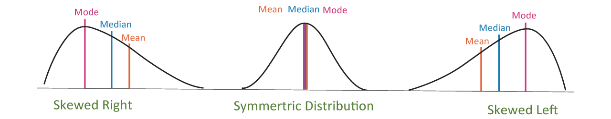

# ECON 2500 - Midterm 1

## Online Tools

[Stem and Leaf Plot Generator](https://www.calculatorsoup.com/calculators/statistics/stemleaf.php)

## Notes

### Variables

|                        | Population Parameter | Sample Statistic |
| ---------------------- |:--------------------:|:----------------:|
| **Mean**               | $\mu$                | $\bar X$         |
| **Standard Deviation** | $\sigma$             | s                |
| **Variance**           | $\sigma^2$           | s$^2$            |
| **Size**               | $N$                  | $n$              |
| **Median**             | $M$                  | $M$              |

### Definitions

* **Categorical Variable**: Value is a non-numeric value. E.g. Eye Colour $\rarr$ Blue

* **Cross-sectional Data**: Multiple entities at a single point in time

* **Time-series Data**:  Single entity across multiple points in time

### Mean

$$
\underbrace{\bar{X} = \frac{\sum X_i}{n}}_{\text{For a sample of size n}}
~~~~~~~~~~~~~~~~~
\underbrace{\mu = \frac{\sum{X}}{n}}_{\text{For a population}}
$$

### Median

- Sort data in ascending order

- If $n$ is odd, the median is the middle number

- If $n$ is even, the median is the average of the two middle-most numbers

### Variance & Standard Deviation

$$
\tag{\text{Variance}} s_x^2 = \frac{(x_1-\bar x)^2 + ... + (x_n - \bar x)^2}{n-1} = 
\frac{\sum(x_i - \bar x)^2}{n-1} = 
\frac{\sum x^2 - \dfrac{n}{\bar x^2}}{n-1} ~~~~~~~~~~~~~~~~~~~~~
$$

$$
\tag{\text{Standard Deviation}} s_x = \sqrt{s_x^2}
$$

- ~68% of data = $\mu \pm \sigma$.

- ~95% of data =$\mu \pm 2\sigma$.

- ~99.7% of data = $\mu \pm 3\sigma$.

### Quartiles

- $Q_1 = $ The median using only the first half of the data

- $Q_3 = $ The median using only the second half of the data

- If $n$ is odd, discard the median

- Interquartile range: $IQR = Q_3 - Q_1$

- E.g: $(1,2,3,4,5) \rarr (1,2) | (4,5) \rarr Q_1=1\frac12,~Q_3=4\frac12\rarr IQR=(4\frac12-1\frac12)=3$

### Five-Number Summary / Box Plot

| Minimum | Q$_1$ | M   | Q$_3$ | Maximum |
| ------- | ----- | --- | ----- | ------- |

### Probability

#### Joint Probability

Probability of 2 events happening. 

E.g. $P(\text{Business} \cap \text{Part-time}) = \frac{150}{1305} = 0.1149 = 11.49\%$

#### Conditional Probability

Probability of an event happening, given that another event

E.g. $P(\text{Full-time}|\text{Business})=
\frac{P(\text{Business} ~\cap~ \text{Full-time})}{P(\text{Business})} = \frac{352}{502} = 0.7012 = 70.12\%$

|               | Business | Engineering | Other | Total |
| ------------- | -------- | ----------- | ----- | ----- |
| **Full-time** | 352      | 197         | 251   | 800   |
| **Part-time** | 150      | 161         | 194   | 505   |
| **Total**     | 502      | 358         | 445   | 1305  |

|               | Business | Engineering | Other  | Total   |
| ------------- | -------- | ----------- | ------ | ------- |
| **Full-time** | 26.97%   | 15.10%      | 19.23% | 61.30%  |
| **Part-time** | 11.49%   | 12.34%      | 14.87% | 38.70%  |
| **Total**     | 38.47%   | 27.43%      | 34.10% | 100.00% |

### Z Score

$$
Z = \frac{X-\mu}{\sigma} ~~~~~~~~~~~~~~~~ |Z|~ \text{contains}
\begin{cases}
68\% \text{ of data} &\text{if } Z\leq1 \\
95\% \text{ of data} &\text{if } Z\leq2 \\
99.7\% \text{ of data} &\text{if } Z\leq3 \\
\end{cases}
$$

### Distribution Skew

### Least Squares Regression

$$
r = \frac{n \sum (xy) - (\sum x)(\sum y)}
{\sqrt{n(\sum x^2)-(\sum x)^2} \sqrt{n(\sum y^2)-(\sum y)^2}}~~~~~~~~~~~~~~~~~~~~~~~~~~~~~~~~~~~~~~~~~~~~~~~~~
\tag{Correlation Coefficient}
$$

$$
\tag{Regression Equation} 
b_1 = r \times \frac{s_x}{s_y} ~~~~~~~~
b_0 = \bar Y - b_1 \bar X ~~~~~~~~
y = b_0 + b_1 x ~~~~~~~~~~~~~~~~~~~~~~~~~~~~~~~~~~~~~~~~~~
$$
