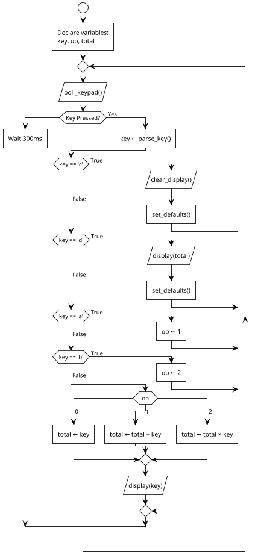

# Prelab 1

### Kyle Schwartz

### 216213621

### EECS 3215 M

### 2022-02-14

Kyle Schwartz - 216213621

```plantuml
@startuml calculator
skinparam ConditionEndStyle hline
scale 0.85
!theme plain
!pragma useVerticalIf on
start
:Declare variables:
key, op, total]
repeat
    :poll_keypad()/
    if (Key Pressed?)
        :Wait 300ms]
    else ( Yes)
        :key ← parse_key()]
        if (key == 'c') then ( True)
            :clear_display()/
            :set_defaults()]
        ( False) elseif (key == 'd') then ( True)
            :display(total)/
            :set_defaults()]
        ( False) elseif (key == 'a') then ( True)
            :op ← 1]
        ( False) elseif (key == 'b') then ( True)
            :op ← 2]
        else ( False)
            switch (op)
                case ( 0)
                    :total ← key]
                case (       1)
                    :total ← total + key]
                case ( 2)
                    :total ← total × key]
            endswitch
            :display(key)/
        endif
    endif
repeat while
@enduml
```
