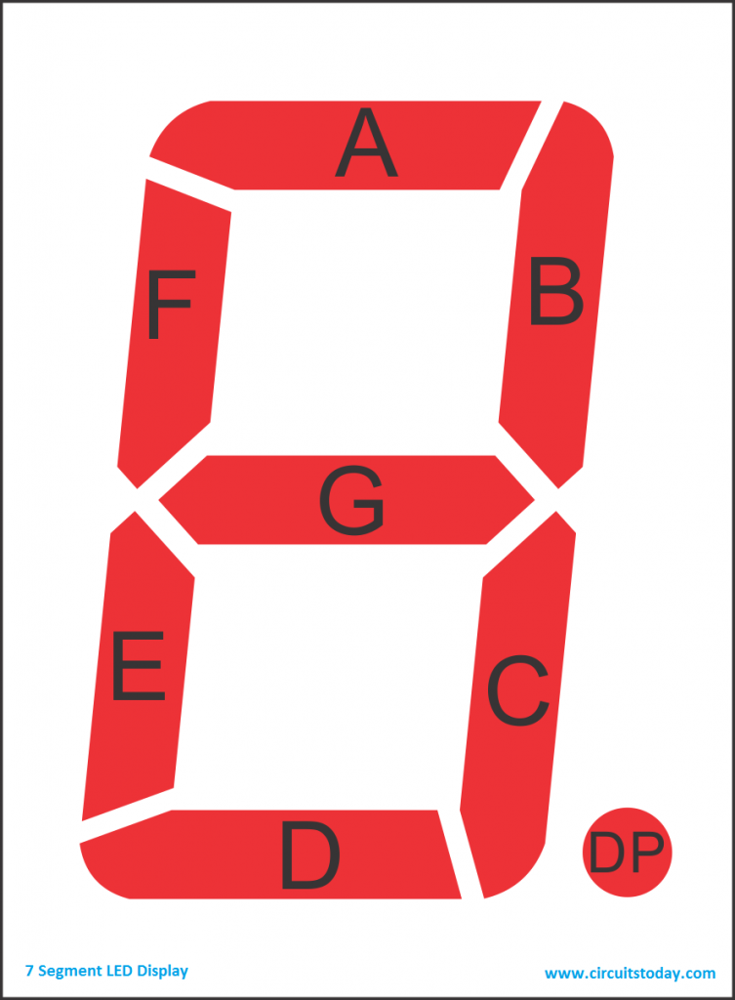

# Midterm Cheat Sheet

## C-Assembly Equivalents

| C                                                                                                                                                                                                                                                                                                                                                                                                                                                                                                                                                                                                                                                                                                                                                                                                                                                                                                                                                                                                                                                                                                                                                                                                                                                                                                                                                                                                                                                                                                 | Assembly                                                                                                                                                                                                                                                                                                                                                                                                                                                                                                                                                                                                                                                                                                                                                                                                                                                                                                                                                                                                                                                                                                                                                                                                                                                                                                                                                                                                                                                                                                                                                                                                                                                                                                    |
|:------------------------------------------------------------------------------------------------------------------------------------------------------------------------------------------------------------------------------------------------------------------------------------------------------------------------------------------------------------------------------------------------------------------------------------------------------------------------------------------------------------------------------------------------------------------------------------------------------------------------------------------------------------------------------------------------------------------------------------------------------------------------------------------------------------------------------------------------------------------------------------------------------------------------------------------------------------------------------------------------------------------------------------------------------------------------------------------------------------------------------------------------------------------------------------------------------------------------------------------------------------------------------------------------------------------------------------------------------------------------------------------------------------------------------------------------------------------------------------------------- |:----------------------------------------------------------------------------------------------------------------------------------------------------------------------------------------------------------------------------------------------------------------------------------------------------------------------------------------------------------------------------------------------------------------------------------------------------------------------------------------------------------------------------------------------------------------------------------------------------------------------------------------------------------------------------------------------------------------------------------------------------------------------------------------------------------------------------------------------------------------------------------------------------------------------------------------------------------------------------------------------------------------------------------------------------------------------------------------------------------------------------------------------------------------------------------------------------------------------------------------------------------------------------------------------------------------------------------------------------------------------------------------------------------------------------------------------------------------------------------------------------------------------------------------------------------------------------------------------------------------------------------------------------------------------------------------------------------- |
| <pre><code class="fenced-code-block language-c">unsigned char A; unsigned char *X, *Y;  while (A != 0) {     *X++ = *Y++;     A--; }</code></pre>                                                                                                                                                                                                                                                                                                                                                                                                     | <pre><code class="fenced-code-block language-llvm">L1: tsta                    ; (A != 0)?     beq    L2               ; If false, jump to L2     movb   1,X+ 1,Y+        ; X=Y, increment both     deca                    ; Decrement a     bra    L1               ; Branch to L1 L2:  </code></pre>                                                                                                                                                                                                                                                                                                                                                                                                                                                                                                                                                                                                                                                                                                                                                                                       |
| <pre><code class="fenced-code-block language-c">void msdelay() {     for (unsigned int j = 0; j &lt; 6250; j++)         __asm("nop"); }</code></pre>                                                                                                                                                                                                                                                                                                                                                                                                                                               | <pre><code class="fenced-code-block language-llvm">msdelay:    ldd    #6250        ; Set delay cycles .Loop:      nop                 ; Do nothing             dbne    d,.Loop     ; Decrement, branch if !=0             rts                 ; return</code></pre>                                                                                                                                                                                                                                                                                                                                                                                                                                                                                                                                                                                                                                                                                                                                                                                                                                                                                                              |
| <pre><code class="fenced-code-block language-c">void test_switch(unsigned int a) {     unsigned int d;     if (a == 1)         d = 5;     else if (a == 2)         d = 10;     else         d = 20; }</code>      </pre> | <pre><code class="fenced-code-block language-llvm">test_switch:     cpa    #1      ; if (a == 1)     beq    .L6     ;   branch to .L6     cpa    #2      ; elif (a == 2)     beq    .L7     ;   branch to .L7     ldd    #20     ; else { d = 20 } .L3:     rts            ; return .L7:     ldd    #10     ; d = 10     bra    .L3     ; branch to .L3 .L6:     ldd    #5      ; d = 5     bra    .L3     ; branch to .L3</code></pre> |

## Bitwise Operators

| Operator                  | Definition              | Example, `a=0b0011`, `b=0b0110`          |
| ------------------------- | ----------------------- | ---------------------------------------- |
| $\text{\textasciitilde}$  | Flip all bits           | $\text{\textasciitilde} a =$`0b1100`     |
| $\And$                    | Bit in both operands    | $a \And b=$`0b0010`                      |
| $\mid$                    | Bit in either operand   | $a \mid b=$`0b0111`                      |
| $\text{\textasciicircum}$ | Bit in only one operand | $a \text{\textasciicircum} ~b=$ `0b0101` |
| $\ll$                     | Move bits to the left   | $a \ll 2 =$ `0b1100`                     |
| $\gg$                     | Move bits to the right  | $b \gg 2 = $`0b0001`                     |

## 7-Segment Display

|  | $X = DP \\ \text{0bXGFEDCBA} \\ \text{e.g: } 3 = $`0b01001111` |
| ---------------------------------------------------------------------------------- |:-------------------------------------------------------------- |
